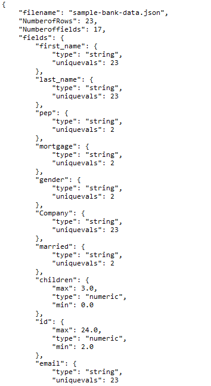
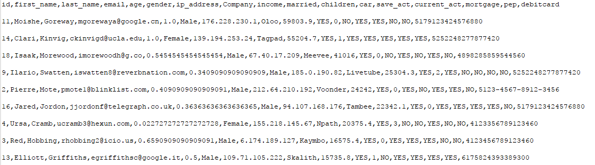

This was a coursework project which is written in python 2.6 and no external libraries were used.

### Generating metadata:
1. Read from the config file the instructions (file to open, columns to pre-process...)
2. Extract the data from a file: can be a .csv, a .txt or a .json
3. Find the number of rows and fields
4. Use regex to determine the data type: determine the min/max (if numeric) and the unique values (if string)
5. Generate a file with the meta-data information

### Pre-process data:
6. Dropping null values
7. Filling missing values 
8. Sorting (asc or desc)
9. Normalising
10. Validating credit card numbers (using regex)

### Notes
Once the repository is downloaded, open CMD and type: python process.py config.json
- The process.py file contains the whole program. It executes with the main() function which further calls 
  other functions in a dedicated order.
- The config.json file has all the information and instructions related to the operations to be performed on the file.

#### Metadata file Output:


#### Preprocessed file output:



## Given below is the code with description of every line 

```python

'''Generating meta-data'''

import sys
import csv
import json
import os
import re
import ast
from collections import OrderedDict

def readConfig(configfile):  # This fuction reads the config file
    with open(configfile) as con:      # the config file is opened as con
                fullfile = json.load(con) 
    return fullfile # Config file is returned 

def readFileAsCSV(l):                   # This Function reads the CSV file and takes the input from the Config.json
    myfile = l.get("inputfile")          # Here we get the name of the inputfile fron Config.json
    with open (myfile) as csvfile:       # file is opened
        datainCSVfile = []               # empty list   
        fileinfo =csv.reader(csvfile)    # Reading the info from the file 
        fileinfo = list(fileinfo)        # Converting the fileinfo into list
        count = 0
        for i in fileinfo:              # iterating through the whole file
            if(count>0):                
                datainCSVfile.append(i)    # appendinf every row in the list datainfile
            else:
                headersinCSVfile = i             # getting all the headers 
                count += 1                   # if the seperator is empty    # read the file from the top
        data = {'headers':headersinCSVfile,'bodydata':datainCSVfile}   # Storing all the information as a dictionary 
    return data     # returning the dictionary 
    
def readFileAsJSON(l): 
    myfile = l.get("inputfile")               # This function reads the JSON file and gets the input from Config.json
    datainJSONfile = []                        # Created an empty list to store all the data
    headersinJSONfile = []                     # Created an empty list to store the fieldnames
    with open(myfile ,'r') as jsonfile:        # Open the Json file
        alldata = json.load(jsonfile, object_pairs_hook=OrderedDict)        # Load the Json file
    count = 0                                  
    typeofdata = type(alldata)                 # Checking the type and storing in another variable
    if typeofdata==type({}):                   # Comparing the type of variable with dictionary type
        headersinJSONfile = alldata.keys()     # Getting all the keys and storing in a list
        datainJSONfile.append(alldata.values()) # Getting all the values and appending in the list
    elif typeofdata==type([]):                  # Comparng the type of variable with list
        for i in alldata:                      # iterating through the whole file 
            if(count==0):
                headersinJSONfile = i.keys()    #Getting the fieldnames and storing in a list
            else:
                datainJSONfile.append(i.values()) # Getting all the rows and appending in a list.
            count += 1
    data = {'headers':headersinJSONfile,'bodydata':datainJSONfile} # Created a dictionary and stored the output in it
    
    return data     # Returning the dictionary

def ColumnIsNum(col): # This function checks if the particular column is numeric or not
    col = str(col) 
    result = False
    colregex = re.compile(r'[-+]?\d*\.?\d*')  # Regex to check the column is numeric   
    d = re.findall(colregex,col)
    if(len(d)>0):
        if(d[0]==col):
            if(d[0] != '.'):
                result = True
    return result # Returns the result as true if the column is numeric

def ColumnisNull(column): # This function takes the input as all the column data 
    column = str(column)
    column = column.upper()  # Converts every column info into upper
    if column == 'NULL' or column == 'NAN':
        return True # Returns true if it matches Null or Nan
    
def infoEveryColumn(columndata,columnname): # In his function we evaluate every column and perform required operation on them
    everycolumnoutput = {}    #Empty dictionary which stores the output of every column
    count = 0
    countOfNum =0
    countOfStr =0
    stringcolumndata = {}
    for data in columndata:   # Iterating through all the columns
        if ColumnisNull(data): # Here we check if the column is null or not 
            count += 1   #  Here we count the number of null columns
            continue
        if ColumnIsNum(data):  # Here we check if the column is numeric or not
            if(countOfNum==0):# if the counter is equal to 0 then convert the values to float and assign to maximum and minimum 
                Maximumofcolumn = float(data)
                Minimumofcolumn = float(data)
            else:
                value = float(data)   # Here we calculate the maximun and minimun of every numeric row
                if value>Maximumofcolumn:
                    Maximumofcolumn =  value
                if value<Minimumofcolumn:
                    Minimumofcolumn =  value
            countOfNum += 1
        else:
            stringcolumndata[data] = True  # Check every column for string data
            countOfStr += 1
    if(countOfNum>countOfStr):
        everycolumnoutput.update({'type' : 'numeric','max':Maximumofcolumn,'min':Minimumofcolumn})
    else:
        everycolumnoutput.update({'type':'string','uniquevals':len(stringcolumndata)})
    return everycolumnoutput # Returns a dictionary of keys and values for the specific type of Colmns.

def generateMetadata(l, data): 
    myfile = l.get("inputfile")  
    metadataoutput=OrderedDict() # Created one empty dictionary to store the info from this function
    metadataoutput.update({"filename": str(myfile)})
    metadataoutput.update({'NumberofRows':len(data['bodydata'])})  # Here we update the dictionary with the no of rows. We have a list of rows stored in the key 'bodydata', we apply function to calculate length of the list.
    metadataoutput.update({'Numberoffields':len(data['headers'])}) # Here we update the dictionary with the no of colmns We have a list of columns stored in the key 'headers', we apply function to calculate length of the list.
    dialect = csv.Sniffer().sniff(str(data['bodydata'][1]))
    filename, ext = os.path.splitext(myfile)# Here we get the name of the file from our main dictionary and update it here.
    if ext =='.csv': # Here we check if the format is tabular
        metadataoutput.update({"Format":{"type":'tabular',"Separators":str(dialect.delimiter)}}) # If its tabular, we update the the dictionary with the type and the seperator of the file
    elif ext =='json':  # Here we check if the format is json
        metadataoutput.update({"Format":{"type":'json'}})  # If its json we just update the type as we dont need any seperator in json format
    count = 0                    
    fieldstype ={}  # Here we create one more dictionary to store the information regarding every column i.e type,max,min,unique
    for fieldname in data['headers']: # Here we iterate through every column
        collist = [row[count] for row in data['bodydata']] #Here we get information of the whole column according the column names
        res = infoEveryColumn(collist,fieldname) # Here res is a dictionary which gets the output from another function in the form of column name, type and maximum,minimum
        fieldstype.update({fieldname:res})  # Here we update the dictionary with the information in the above step 
        count += 1
    metadataoutput.update({'fields':fieldstype}) # Here we update our metadat dictionary with all the outputs from fieldstype dictionry
    return metadataoutput
```

	

```python

'''Pre-processing data'''

def CreateJSONFile(l, mydict):  # This funcion writes a Json file, it gets the input as 
    with open(l.get('metafile'),'w') as f:   # Open the file as 
        json.dump(mydict,f, indent=4,sort_keys=False)
    

def dropnull(l, data): # This function drops the rows, where particular columnn has null or nan 
    dropnullfields = l['preprocess']['missing']['dropnull']  # Here we get the info of the columns 
    evaldic = ast.literal_eval(json.dumps(dropnullfields)) # Here we convert the unicode values into strings
    fullcolumn = data['bodydata']   # Here we have all the info of the row
    UpdatedDataofrows = [data['headers']]
    goodRows = []
    index = data['headers'].index(evaldic[0]) # Here we search for the column in the data
    for record in fullcolumn:  # Here we iterate in the data and append the rows if the ColisNull function returns False
        if ColumnisNull(record[index]) is not True:  #
            goodRows.append(record[0])
    for record in fullcolumn:
        if record[0] in goodRows:  
            UpdatedDataofrows.append(record)  # Appening the rows in a list
    return UpdatedDataofrows # Returning the list with updated dropped rows
  
def fillnull(l, data): # This function fills all the null values in the particular columns and input are Config.json and List of data from dropnul function
    fillnullfields = l['preprocess']['missing']['fillnull']
    evaldic = ast.literal_eval(json.dumps(fillnullfields)) 
    vals0 = evaldic.values()[0]    #Extracting the name of the columns and default values 
    vals1 = evaldic.values()[1]
    keys0 =  evaldic.keys()[0]
    keys1 =  evaldic.keys()[1]
    getindex0 = data[0].index(keys0)
    getindex1 = data[0].index(keys1)
    fullcolumndata=[data[0]]
    for record in data[1:]:   # Iteratinf through the data and checking the null columns and replacing null or nan with the default values 
        if ColumnisNull(record[getindex1]): 
            record[getindex1] = vals1
        if ColumnisNull(record[getindex0]):
            record[getindex0] = vals0
        fullcolumndata.append(record)   # Appending every updated column in the list
    return fullcolumndata # Returning the list with the updated columns

def normalise(l, data, w): # add appropriate args
    getNormcolum = l['preprocess']['normalise'][0]
    i = data[0].index(getNormcolum)
    # Here we get the info of the columns we need to normalize  # Here we iterate through particular columns
    maximum = w['fields'][getNormcolum]['max']   #  Here we get the maximun from that particular  column
    minimum = w['fields'][getNormcolum]['min'] 
    normaliseddatafull = [data[0]]#  Here we get the minimum from that particular column
    for item in data[1:]: # Here we iterate through all the column data
        fvalue = float(item[i]) # We convert all the values of that column into float, inorder to perform arithmetic funtions
        item[i] = (fvalue - minimum) / (maximum - minimum) # This the formla i used for normalizing the column
        normaliseddatafull.append(item)
    return normaliseddatafull

def sortData(l, data):  # This function sorts the data according to the particular column, it takes input as Config file and the output of normalized data 
    sortorder = str(l['preprocess']['sorting']['order'])
    sortfield = str(l['preprocess']['sorting']['field'])
    columnindex = data[0].index(sortfield)
    if sortorder == 'desc':
        sorteddataoutput=sorted(data,key=lambda l:l[columnindex], reverse=True)  # Sorted function sorts the columns in desc if the reverse is false
    if sortorder == 'asce':
        sorteddataoutput=sorted(data,key=lambda l:l[columnindex], reverse=False) # Sorted function sorts the columns in desc if the reverse is True
    sorteddataoutput[0] = data[0]
    return sorteddataoutput # Returns the output as a sorted list according to the columns
 
def validation(l, data):# This function validates the particular column
    if l['preprocess']['validate_card'] == True:   # if the config.json has value as true then perform the operations else do nothing
        myfile = l.get("inputfile")   #  Getting the name of the file  
        filename, ext = os.path.splitext(myfile)  # Getting the extension of the file
        string1 = r"(^[456])"  # The debit card number starts with 4,5 or 6
        string2 = r"(\d{4})(-?)(\d{4})(\2\d{4}){2}"  # only numbers,may include hyphen or space
        string3 = r"((\d)(?!\2{3})){16}"  # no consequetive 4 numbers and 16 digits
        index = data[0].index('debitcard')
        listdam=[]
        if ext == ".csv":  
            for x in range(1,len(data)):
                if re.match(string1, data[x][index]) and re.match(string2, data[x][index]): # matching the data with the regex
                    k = data[x][index]
                    k = k.replace("-", "")  # Replacing hyphen with space to check the regex
                    if re.match(string3, k):
                        listdam.append(data[x][0])  # apending the list with the Id's of the rows which matched
        if ext == ".json" :
            for x in range(1, len(data)):
                if re.match(string1, str(data[x][index])) and re.match(string2, str(data[x][index])):
                    k = str(data[x][index])
                    #Removal of the spaces or hyphens to make the last check easier
                    k = k.replace("-", "")  # Replacing hyphen with space to check the regex
                    if re.match(string3, k):
                        listdam.append(data[x][0])    #list will contain the id of the rows which passed the debit card test
        return listdam
    else:
        return data

def removeInvalidDebitCardEntries(l, data, w):   # This function removes all the invalid card entries. It takes input as sorted data and list of ID's which matched regex
    cleanlist=[data[0]]
    for x in range(1, len(data)):
        if data[x][0] in w:  
            cleanlist.append(data[x])    # Adding all the values to the list which matched perfectly
    return cleanlist
 
def preprocessData(config, data):  # This function is used to preprocess the data
    UpdatedDataofrows = dropnull(config, data)  #  This function drops the rows which have column with nul or nan
    fullcolumndata = fillnull(config, UpdatedDataofrows) # This function rplaces the null values with 0 and no for particular columns
    metadataoutput = generateMetadata(config, data)
    normaliseddatafull = normalise(config, fullcolumndata, metadataoutput) # This function
    sorteddataoutput = sortData(config, normaliseddatafull)
    listdam = validation(config, sorteddataoutput)
    preprocesseddata = removeInvalidDebitCardEntries(config, sorteddataoutput, listdam)
    return preprocesseddata
```

```python

'''The main function'''

def main(configFile):  # This is the main function which gets the input as the config.json file
    config = readConfig(configFile)    #   Reading the config file
    myfile = config.get("inputfile")   # Getting the inputfile name frrom Config.json
    filename, ext = os.path.splitext(myfile)   #  Getting the extension of the file by splitting the filename
    if ext == ".json":      
        data = readFileAsJSON(config)    #   Reads the file as JSON
    if ext == ".csv":
        data = readFileAsCSV(config)     #   Reads the file as CSV
    metadataoutput = generateMetadata(config, data)   #Generating metadata 
    CreateJSONFile(config, metadataoutput)     #  Create the metadata file
    preprocesseddata = preprocessData(config, data)   #  Generate preprocessed data
    with open(config.get("outputfile"), mode="w") as out :  # Getting the name of the outputfile and write the data to it.
        clean = csv.writer(out, delimiter=',')
        for line in preprocesseddata:
            clean.writerow(line)
    return 

if __name__ == '__main__':
    if(len(sys.argv)>1):
        configFile = sys.argv[1]
    else:
        configFile = "config.json"
    main(configFile)
	
```