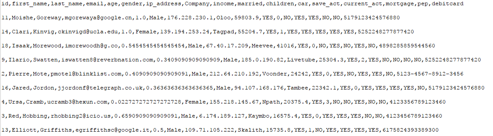
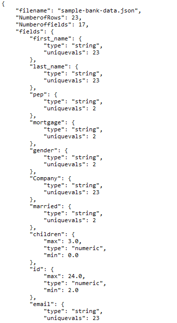

# Generating Metadata and Preprocessing

This was a coursework assignment which is written in python 2.6 and no external libraries were used.

Once the repository is downloaded, open CMD and type: python process.py config.json
- The process.py file contains the whole program. It executes with the main() function which further calls 
  other functions in a dedicated order.
- The config.json file has all the information and instructions related to the operations to be performed on the file.

The assignment was focused towards:
i) Generating Metadata from the input file which can be .txt,.csv or .json
   While generating the metadata file we read the type of file and calculate rows and columns.
   For every column we check the type of column,if its string we print the number of unique values
   and if its numeric then we print the maximum and minimum value.
ii) Preprocessing of the generated file which included dropping the null values, filling missing values,
	sorting, normalising and validating the columns.
	
## Metadata file Output:

## Preprocessed file output:

